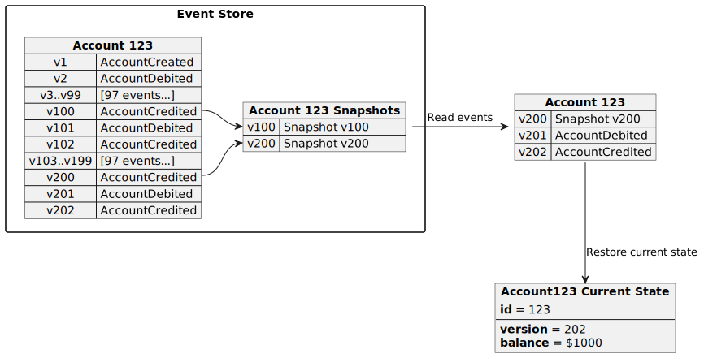
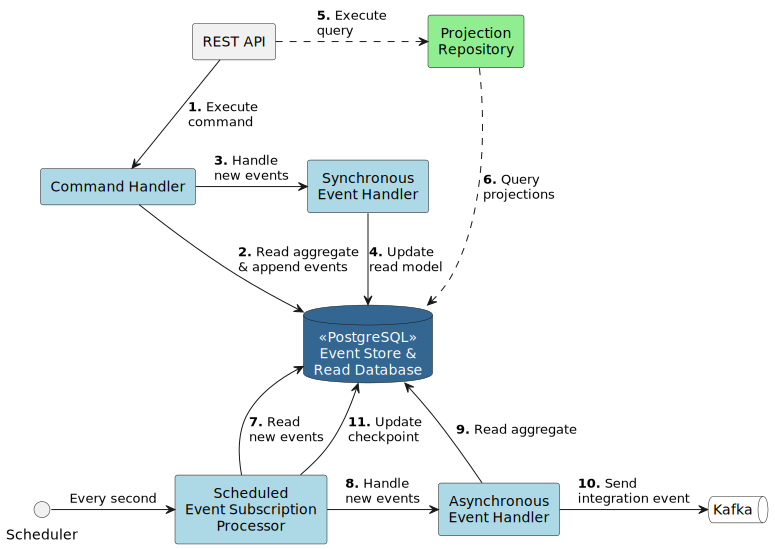
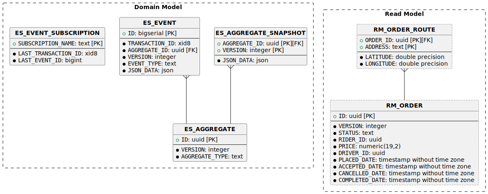
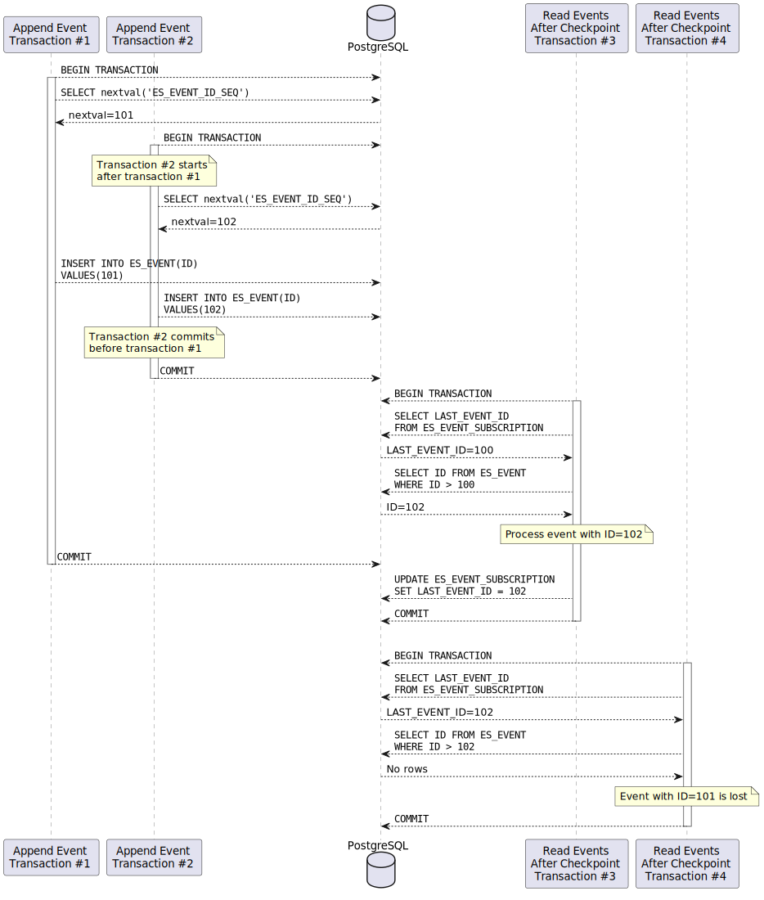
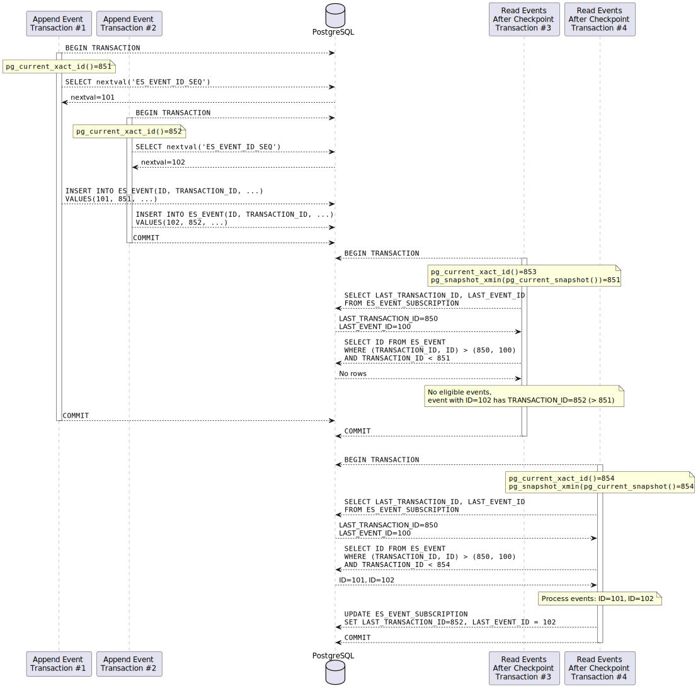
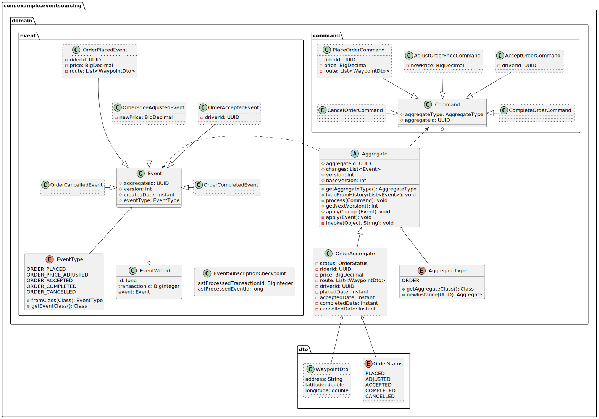
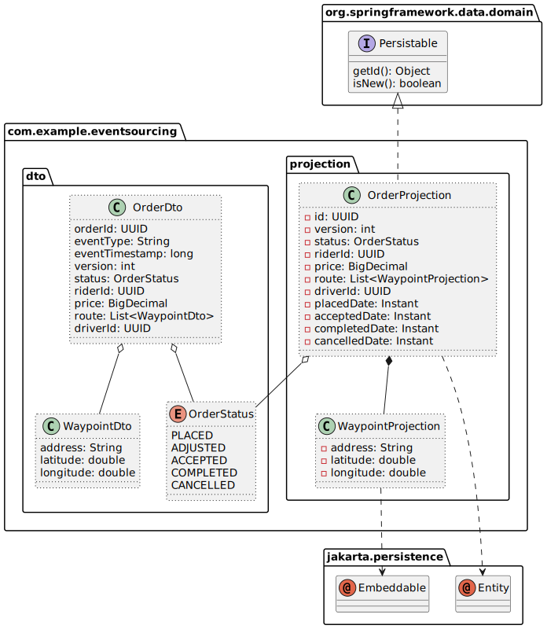
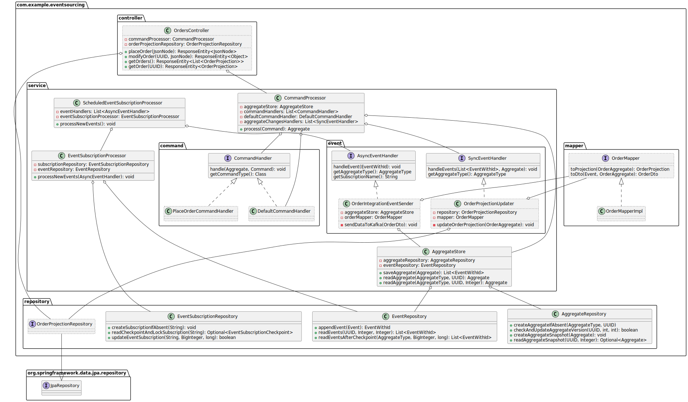

# <a id="0"></a>Event Sourcing with PostgreSQL and Kotlin
***Note***: This project started as a fork of [postgresql-event-sourcing](https://github.com/evgeniy-khist/postgresql-event-sourcing) and it has been heavily refactored to leverage the kotlin ecosystem.

- [Introduction](#1)
- [Example domain](#2)
- [Event sourcing and CQRS basics](#3)
  - [State-oriented persistence](#3-1)
  - [Event sourcing](#3-2)
  - [Snapshotting](#3-3)
  - [Querying the data](#3-4)
  - [CQRS](#3-5)
  - [Event handlers](#3-6)
  - [Domain events vs Integration events](#3-7)
  - [Advantages of CQRS](#3-8)
  - [Advantages of event sourcing](#3-9)
- [Solution architecture](#4)
  - [Component diagram](#4-1)
  - [ER diagram](#4-2)
  - [Optimistic concurrency control](#4-3)
  - [Snapshotting](#4-4)
  - [Loading any revision of the aggregate](#4-5)
  - [Synchronously updating projections](#4-6)
  - [Asynchronously sending integration events to a message broker](#4-7)
    - [Reliable transactional outbox with PostgreSQL](#4-7-1)
    - [Database polling alternatives](#4-7-2)
  - [Adding new asynchronous event handlers](#4-8)
  - [Class diagrams](#4-9)
    - [Class diagram of the domain model](#4-9-1)
    - [Class diagram of the projections](#4-9-2)
    - [Class diagram of the service layer](#4-9-3)
  - [Drawbacks](#4-10)
- [How to run the sample?](#5)

<!-- Table of contents is made with https://github.com/evgeniy-khist/markdown-toc -->

## <a id="1"></a>Introduction

Usually, our applications operate with the current state of a domain object.
But sometimes, we need to know the entire history of the domain object changes.
For example, we want to know how an order got into its current state.

The audit trail (also called the audit log) is a chronological record of the history
and details of the actions that affected the system.
An audit trail may be a regulatory or business requirement.

We can store all changes to the domain object state as a sequence of events in an append-only event stream.
Thus, event streams will contain an entire history of changes.
But how can we be sure that this history is authentic and error-free?
We can use event streams as a primary source of truth in a system.
To get the current state of an object, we have to replay all events in the order of occurrence.
This pattern is called event sourcing. The database for storing the event streams is called even store.
Event sourcing provides a complete and accurate record of all changes made to a system.
Event sourcing is an industry standard for implementing audit trail.

There are specialized databases for event sourcing.
Developer Advocates working for the companies behind these specialized databases said
you shouldn't implement event sourcing with traditional relational or document-oriented databases.
Is this true or just a marketing ploy?

Specialized databases for event sourcing are convenient and provide the necessary functionality out of the box.
But PostgreSQL, the world's most advanced open-source database, is also suitable for event sourcing.
You can use PostgreSQL as an event store without additional frameworks or extensions
instead of setting up and maintaining a separate specialized database for event sourcing.

This repository provides a reference implementation of event sourced system that uses PostgreSQL as an event store.
You can also [fork](https://github.com/evgeniy-khist/postgresql-event-sourcing/fork) the repo
and use it as a template for your projects.


See also

* [Event Sourcing with EventStoreDB](https://github.com/evgeniy-khist/eventstoredb-event-sourcing)
* [Event Sourcing with Kafka and ksqlDB](https://github.com/evgeniy-khist/ksqldb-event-souring)

## <a id="2"></a>Example domain

This sample uses a simplified domain model of the ride-hailing system.

* A rider can place an order for a ride along a route specifying a price.
* A rider can edit an order price to pay more instead of waiting in cases of very high demand.
* A driver can accept an order.
* A driver can complete previously accepted order.
* An order can be canceled before completion.


## <a id="3"></a>Event sourcing and CQRS basics

### <a id="3-1"></a>State-oriented persistence

State-oriented persistence (CRUD) applications store only the latest version of an entity.
Database records present entities.
When an entity is updated, the corresponding database record gets updated too.
SQL `INSERT`, `UPDATE` and `DELETE` statements are used.


### <a id="3-2"></a>Event sourcing

Event sourcing applications persist the state of an entity as a sequence of immutable state-changing events.


Whenever the state of an entity changes, a new event is appended to the list of events.
Only SQL `INSERT` statements are used.
Events are immutables, so SQL `UPDATE` and `DELETE` statements are not used.


The current state of an entity can be restored by replaying all its events.

Event sourcing is closely related to domain-driven design (DDD) and shares some terminology.

An entity in event sourcing is called an **aggregate**.

A sequence of events for the same aggregate is called a **stream**.

Event sourcing is best suited for short-living entities with a small total number of
events (e.g., orders).

Restoring the state of the short-living entity by replaying all its events doesn't have any
performance impact. Thus, no optimizations for restoring state are required for short-living
entities.

For endlessly stored entities (e.g., users, bank accounts) with thousands of events restoring state
by replaying all events is not optimal, and snapshotting should be considered.

### <a id="3-3"></a>Snapshotting

Snapshotting is an optimization technique where a snapshot of the aggregate's state is also saved,
so an application can restore the current state of the aggregate from the snapshot rather than from
all the events (potentially thousands).

On every *nth* event, make an aggregate snapshot by storing an aggregate state and its version.

To restore an aggregate state:

1. first read the latest snapshot,
2. then read events forward from the original stream starting from the version pointed by the snapshot.



### <a id="3-4"></a>Querying the data

It's easy to find an aggregate by ID, but other queries are difficult.
Since aggregates are stored as append-only lists of immutable events,
querying the data using SQL, as we used to, is impossible.
To find an aggregate by some field, we need to first read all the events and replay them to restore all the aggregates.

To bring back all the querying power a relational database has to offer,
we can create a dedicated read model derived from the event stream.

The event stream is the write model and the primary source of truth.

The read model is a "denormalized" view of the write model, allowing faster and more convenient querying.
Read models are projections of the system state.
Therefore, read models are also known as **projections**.

Projections provide a view of data for a single aggregate type
or perform aggregations and combine data from multiple aggregate types.

That's where CQRS comes in handy.

### <a id="3-5"></a>CQRS

Command-query responsibility segregation (CQRS) stands for segregating the responsibility between
commands (write requests) and queries (read requests).
The write requests and the read requests are processed by different handlers.

A command generates zero or more events or results in an error.


CQRS is a self-sufficient architectural pattern and doesn't require event sourcing.
But in practice, event sourcing is usually used in conjunction with CQRS.
Event store is used as a write database, and SQL or NoSQL database as a read database.


### <a id="3-6"></a>Event handlers

Commands generate events.
Event processing is done by **event handles**.
As a part of event processing, we may need to update projections,
send a message to a message broker, or make an API call.

There are two types of event handles: **synchronous** and **asynchronous**.

Storing the write model and read model in the same database allows for transactional updates of the read model.
Each time we append a new event, the projection is updated **synchronously** in the same transaction.
The projection is **consistent** with the event stream.

When an event handler communicates with an external system or middleware (e.g., sends a message to Kafka),
it should run **asynchronously** after the transaction updating the write model.
Asynchronous execution leads to **eventual consistency**.

Communication with external systems should not occur in the same transaction updating the write model.
The external system call may succeed, but the transaction will later be rolled back, resulting in an inconsistency.

Anyway, distributed systems should be designed with eventual consistency in mind.

### <a id="3-7"></a>Domain events vs Integration events

Events in event sourcing are **domain events**.
The domain event is a part of a bounded context and should not be used "as-is" for integration with other bounded
contexts.

For communication between bounded contexts **integration events** are used.
The integration event represents the current state of an aggregate, not just changes to the aggregate as a domain event.

### <a id="3-8"></a>Advantages of CQRS

* Independent scaling of the read and write databases.
* Optimized data schema for the read database (e.g. the read databases can be denormalized).
* Simpler queries (e.g. complex `JOIN` operations can be avoided).

### <a id="3-9"></a>Advantages of event sourcing

* A true history of the system (audit and traceability).
  An industry standard for implementing audit trail.
* Ability to put the system in any prior state (e.g. for debugging).
* New read-side projections can be created as needed (later) from events.
  It allows responding to future needs and new requirements.

## <a id="4"></a>Solution architecture

PostgreSQL can be used as an event store.
It will natively support appending events, concurrency control and reading events.
Subscribing on events requires additional implementation.

### <a id="4-1"></a>Component diagram



### <a id="4-2"></a>ER diagram



Events are stored in the `ES_EVENT` table.

### <a id="4-3"></a>Optimistic concurrency control

Latest aggregate version is stored in the `ES_AGGREGATE` table.
Version checking is used for optimistic concurrency control.
Version checking uses version numbers to detect conflicting updates (and to prevent lost updates).

Appending an event operation consists of 2 SQL statements in a single transaction:

1. check the actual and expected version match and increment the version
    ```sql
    UPDATE ES_AGGREGATE
       SET VERSION = :newVersion
     WHERE ID = :aggregateId
       AND VERSION = :expectedVersion
    ```
2. insert new event
    ```sql
    INSERT INTO ES_EVENT (TRANSACTION_ID, AGGREGATE_ID, VERSION, EVENT_TYPE, JSON_DATA)
    VALUES(pg_current_xact_id(), :aggregateId, :version, :eventType, :jsonObj::json)
    RETURNING ID, TRANSACTION_ID::text, EVENT_TYPE, JSON_DATA
    ```
   `pg_current_xact_id()` returns the current transaction's ID. The need for this will be explained later.

### <a id="4-4"></a>Snapshotting

On every *nth* event insert an aggregate state (snapshot) to the `ES_AGGREGATE_SNAPSHOT` table specifying the version

```sql
INSERT INTO ES_AGGREGATE_SNAPSHOT (AGGREGATE_ID, VERSION, JSON_DATA)
VALUES (:aggregateId, :version, :jsonObj::json)
```

Snapshotting for an aggregate type can be disabled and configured in the `application.yml`

```yaml
event-sourcing:
  snapshotting:
    # com.example.eventsourcing.model.AggregateType
    ORDER:
      enabled: true
      # Create a snapshot on every nth event
      nth-event: 10
```

### <a id="4-5"></a>Loading any revision of the aggregate

To restore any revision of the aggregate:

1. first read the latest value of the snapshot
    ```sql
    SELECT a.AGGREGATE_TYPE,
           s.JSON_DATA
      FROM ES_AGGREGATE_SNAPSHOT s
      JOIN ES_AGGREGATE a ON a.ID = s.AGGREGATE_ID
     WHERE s.AGGREGATE_ID = :aggregateId
       AND (:version IS NULL OR s.VERSION <= :version)
     ORDER BY s.VERSION DESC
     LIMIT 1
    ```
2. then read forward from the event stream from the revision the snapshot points to
    ```sql
    SELECT ID,
           TRANSACTION_ID::text,
           EVENT_TYPE,
           JSON_DATA
      FROM ES_EVENT
     WHERE AGGREGATE_ID = :aggregateId
       AND (:fromVersion IS NULL OR VERSION > :fromVersion)
       AND (:toVersion IS NULL OR VERSION <= :toVersion)
     ORDER BY VERSION ASC
    ```

### <a id="4-6"></a>Synchronously updating projections

Using PostgreSQL as an event store and a read database allows for transactional updates of the read model.
Each time we append a new event, the projection is updated synchronously in the same transaction.
It's a big advantage because sometimes consistency is not so easy to achieve.

You can't get consistent projections when a separate database is used as an event store.

### <a id="4-7"></a>Asynchronously sending integration events to a message broker

Integration events should be sent asynchronously after the transaction updating the write model.

PostgreSQL doesn't allow subscribing on changes, so the solution is a Transactional Outbox pattern.
A service that uses a database inserts events into an outbox table as part of the local transaction.
A separate process publishes the events inserted into database to a message broker.


We may have multiple asynchronous event handlers or so-called subscriptions.
The subscription concept is required to keep track of delivered events separately for different event handlers.
The last event processed by the event handler (subscription) is stored in the separate table `ES_EVENT_SUBSCRIPTION`.
New events are processed by polling the `ES_EVENT` table.


Since multiple backend instances can run in parallel,
we need to ensure that any processing only affects the event once.
We don't want more than one event handler instance to handle the same event.

This is achieved by acquiring locks on the rows of the `ES_EVENT_SUBSCRIPTION` table.
We lock the row (`SELECT FOR UPDATE`) of the currently processed subscription.

To not hang other backend instances, we want to skip already locked rows (`SELECT FOR UPDATE SKIP LOCKED`)
and lock the "next" subscription.
It allows multiple backend instances to select different subscriptions that do not overlap.
This way, we improve availability and scalability.

The event subscription processor polls `ES_EVENT_SUBSCRIPTION` table every second (interval is configurable) for new events
and processes them:

1. read the last transaction ID and event ID processed by the subscription and acquire lock
    ```sql
    SELECT LAST_TRANSACTION_ID::text,
           LAST_EVENT_ID
      FROM ES_EVENT_SUBSCRIPTION
     WHERE SUBSCRIPTION_NAME = :subscriptionName
       FOR UPDATE SKIP LOCKED
    ```
2. read new events
    ```sql
    SELECT e.ID,
           e.TRANSACTION_ID::text,
           e.EVENT_TYPE,
           e.JSON_DATA
      FROM ES_EVENT e
      JOIN ES_AGGREGATE a on a.ID = e.AGGREGATE_ID
     WHERE a.AGGREGATE_TYPE = :aggregateType
       AND (e.TRANSACTION_ID, e.ID) > (:lastProcessedTransactionId::xid8, :lastProcessedEventId)
       AND e.TRANSACTION_ID < pg_snapshot_xmin(pg_current_snapshot())
     ORDER BY e.TRANSACTION_ID ASC, e.ID ASC
    ```
    A comparison like `(a, b) > (c, d)` is a row comparison and is equivalent to `a > c OR (a = c AND b > d)`.
3. update the last transaction ID and event ID processed by the subscription
    ```sql
    UPDATE ES_EVENT_SUBSCRIPTION
       SET LAST_TRANSACTION_ID = :lastProcessedTransactionId::xid8,
           LAST_EVENT_ID = :lastProcessedEventId
     WHERE SUBSCRIPTION_NAME = :subscriptionName
    ```

#### <a id="4-7-1"></a>Reliable transactional outbox with PostgreSQL

Using only the event ID to track events processed by the subscription is unreliable 
and can result in lost events.

The `ID` column of the `ES_EVENT` table is of type `BIGSERIAL`.
It's a notational convenience for creating ID columns having their default values assigned from a `SEQUENCE` generator.

PostgreSQL sequences can't be rolled back.
`SELECT nextval('ES_EVENT_ID_SEQ')` increments and returns the sequence value.
Even if the transaction is not yet committed, the new sequence value becomes visible to other transactions. 

If transaction #2 started after transaction #1 but committed first,
the event subscription processor can read the events created by transaction #2, update the last processed event ID,
and thus lose the events created by transaction #1.



We use transaction ID with event ID to build a reliable PostgreSQL polling mechanism that doesn't lose events.

Each event is supplemented with the current transaction ID.
`pg_current_xact_id()` returns the current transaction's ID of type `xid8`.
`xid8` values increase strictly monotonically and cannot be reused in the lifetime of a database cluster.

The latest event that is "safe" to process is right before the `xmin` of the current snapshot. 
`pg_current_snapshot()` returns a current snapshot, a data structure showing which transaction IDs are now in-progress.
`pg_snapshot_xmin(pg_snapshot)` returns the `xmin` of a snapshot.
`xmin` is the lowest transaction ID that was still active. 
All transaction IDs less than `xmin` are either committed and visible, or rolled back.

Even if transaction #2 started after transaction #1 and committed first,
the events it created won't be read by the event subscription processor until transaction #1 is committed.



Event subscription processing can be disabled and configured in the `application.yml`

```yaml
event-sourcing:
  subscriptions:
    enabled: true
    polling-initial-delay: PT1S
    polling-interval: PT1S
```

#### <a id="4-7-2"></a>Database polling alternatives

PostgreSQL `LISTEN`/`NOTIFY` functionality can be used instead of polling.

A key limitation of the PostgreSQL JDBC driver is that it cannot receive asynchronous notifications 
and must poll the backend to check if any notifications were issued. 
A timeout can be given to the poll function, 
but then the execution of statements from other threads will block.

Thus, the creation of a long-lived dedicated JDBC `Connection` for receiving notifications is required.
This connection should not be obtained from a pooled DataSources. 
Instead, a dedicated `Connection` has to be created using the `DriverManager` API.

In practice, implementations based on PostgreSQL `LISTEN`/`NOTIFY` are quite complex. 
For example,
[PostgresChannelMessageTableSubscriber](https://github.com/spring-projects/spring-integration/blob/v6.0.0/spring-integration-jdbc/src/main/java/org/springframework/integration/jdbc/channel/PostgresChannelMessageTableSubscriber.java)
from the Spring Integration.

### <a id="4-8"></a>Adding new asynchronous event handlers

After restarting the backend, existing subscriptions will only process new events after the last processed event 
and not everything from the first one.

New subscriptions (event handlers) in the first poll will read and process all events.
Be careful, if there are too many events, they may take a long time to process.

### <a id="4-9"></a>Class diagrams

This reference implementation can be easily extended to comply with your domain model.

#### <a id="4-9-1"></a>Class diagram of the domain model



#### <a id="4-9-2"></a>Class diagram of the projections



#### <a id="4-9-3"></a>Class diagram of the service layer



### <a id="4-10"></a>Drawbacks

Using PostgreSQL as an event store has a lot of advantages, but there are also drawbacks.

1. **Asynchronous event handlers can process the same event more than once.** 
   It might crash after processing an event but before recording the fact that it has done so. 
   When it restarts, it will then process the same event again (e.g., send an integration event).
   Integration events are delivered with **at-least-once** delivery guarantee.
   The exactly-once delivery guarantee is hard to achieve due to a dual-write.
   A dual-write describes a situation when you need to atomically update the database and publish messages
   without two-phase commit (2PC).
   Consumers of integration events should be idempotent and filter duplicates and unordered events.
2. The asynchronous event handling results in the **eventual consistency between the write model and sent integration events**.
   The polling database table for new events with a fixed delay introduces a full consistency lag 
   greater than or equal to the interval between polls (1 second by default).
3. **A long-running transaction in the same database will effectively "pause" all event handlers.** 
   `pg_snapshot_xmin(pg_snapshot)` will return the ID of this long-running transaction
   and events created by all later transactions will be read by the event subscription processor 
   only after this long-running transaction is committed.

## <a id="5"></a>How to run the sample?

1. Download & install [SDKMAN!](https://sdkman.io/install).

2. Install JDK 17
    ```bash
    sdk list java
    sdk install java 17.0.x-tem
    ```

3. Install [Docker](https://docs.docker.com/engine/install/)
   and [Docker Compose](https://docs.docker.com/compose/install/).

4. Build Java project and Docker image
    ```bash
    ./gradlew clean build bootBuildImage -i
    ```

5. Run PostgreSQL, Kafka and event-sourcing-app
    ```bash
    docker compose up -d --scale event-sourcing-app=2
    # wait a few minutes
    ```

6. Follow the logs of the application
    ```bash
    docker compose logs -f event-sourcing-app
    ```
   
7. Run E2E tests and see the output
    ```bash
    E2E_TESTING=true; ./gradlew clean test -i
    ```

8. Explore the database using the Adminer database management tool at http://localhost:8181.
   Find the database name, user, and password in the [docker-compose.yml](docker-compose.yml).
   
You can also manually call the REST API endpoints.

1. Install [curl](https://curl.se/) and [jq](https://stedolan.github.io/jq/)
    ```bash
    sudo apt install curl jq
    ```

2. Place new order
    ```bash
    ORDER_ID=$(curl -s -X POST http://localhost:8080/orders -d '{"riderId":"63770803-38f4-4594-aec2-4c74918f7165","price":"123.45","route":[{"address":"Kyiv, 17A Polyarna Street","lat":50.51980052414157,"lon":30.467197278948536},{"address":"Kyiv, 18V Novokostyantynivska Street","lat":50.48509161169076,"lon":30.485170724431292}]}' -H 'Content-Type: application/json' | jq -r .orderId)
    ```

3. Get the placed order
    ```bash
    curl -s -X GET http://localhost:8080/orders/$ORDER_ID | jq
    ```

4. Accept the order
    ```bash
    curl -s -X PUT http://localhost:8080/orders/$ORDER_ID -d '{"status":"ACCEPTED","driverId":"2c068a1a-9263-433f-a70b-067d51b98378"}' -H 'Content-Type: application/json'
    ```

5. Get the accepted order
    ```bash
    curl -s -X GET http://localhost:8080/orders/$ORDER_ID | jq
    ```

6. Complete the order
    ```bash
    curl -s -X PUT http://localhost:8080/orders/$ORDER_ID -d '{"status":"COMPLETED"}' -H 'Content-Type: application/json'
    ```

7. Get the completed order
    ```bash
    curl -s -X GET http://localhost:8080/orders/$ORDER_ID | jq
    ```

8. Try to cancel a completed order to simulate business rule violation
    ```bash
    curl -s -X PUT http://localhost:8080/orders/$ORDER_ID -d '{"status":"CANCELLED"}' -H 'Content-Type: application/json' | jq
    ```

9. Print integration events
    ```bash
    docker compose exec kafka /bin/kafka-console-consumer --bootstrap-server localhost:9092 --topic order-events --from-beginning --property print.key=true --timeout-ms 10000
    ```
